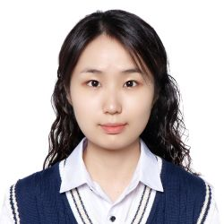

# Laidai
*Master of Science in Artificial Intelligence, Northwestern University*

---

## 🧰 Skills

**Programming Languages:** Python (NumPy, Pandas, PyTorch), C, C++, Ruby, SQL, HTML/CSS, JavaScript, Verilog  
**Tools:** Linux, Flask, Git, Makefile, Docker, MySQL, AWS, Azure AI  

---

## 🔗 Navigation
[Education](/education/) | [Experience](/experience/) | [Projects](/projects/) | [Contact](/contact/)
